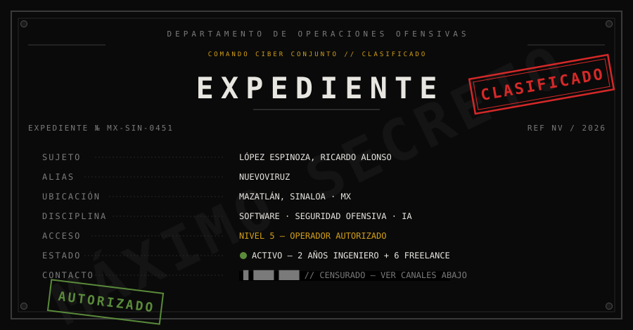

  

TRANSMISSION CHANNELS

  
  
  
  

<code>§ § §   //   CLASSIFIED MATERIAL — DO NOT DISTRIBUTE   //   § § §</code>

## § 01 · OPERATIONAL DOMAINS

<table>
  <tr>
    <td align="center" width="33%">
      DOMAIN <b>PRODUCT</b> 
      5 ERPs in production NestJS · Prisma · Next.js
    </td>
    <td align="center" width="33%">
      DOMAIN <b>OFFENSIVE SECURITY</b> 
      Decepticon · 11 operators 6 engagements · 5 HTB
    </td>
    <td align="center" width="33%">
      DOMAIN <b>AI AGENTS</b> 
      7 repos · NuevoViruz Sentinel · OpenCode Mobile
    </td>
  </tr>
</table>

  

<code>▔ ▔ ▔ ▔ ▔   //   END § 01   //   ▔ ▔ ▔ ▔ ▔</code>

## § 02 · PRIMARY ASSET — DECEPTICON

  

Autonomous pentest framework on **LangGraph** — full kill-chain, from reconnaissance to report.

<table>
  <tr><td width="22%">REASONING</td><td>Senior-pentester middleware · tech-stack → TTPs · exploit-chain inference · lateral thinking</td></tr>
  <tr><td>REPORTING</td><td>Markdown → PDF / HTML / DOCX · executive + technical · ES / EN</td></tr>
  <tr><td>CONTROL</td><td>Rules of Engagement · human gates per phase · SDK · SARIF findings · internal benchmark</td></tr>
</table>

<code>▔ ▔ ▔ ▔ ▔   //   END § 02   //   ▔ ▔ ▔ ▔ ▔</code>

## § 03 · FIELD OPERATIONS — black-box (authorized)

  
  
  

| OP | TARGET | OUTCOME |
|---|---|---|
| 01 | Puropollo |  IDOR — 22,450 users exposed |
| 02 | SIGROMEX |  JWT cross-tenant → SuperAdmin + PII |
| 03 | Tarjeta Amiga |  10 vulns (3 critical) pre-prod |
| 04 | CBTIS / DGETI |  auth bypass + SQLi + PII dump |
| 05 | Hello Sushi |  mass carding via Clip |
| 06 | Revista Espejo |  post-intrusion OSINT |

+ IZZI / MegaCable routers · monitor mode BCM4387 (M1 Pro) · 5 Hack The Box compromised autonomously

<code>▔ ▔ ▔ ▔ ▔   //   END § 03   //   ▔ ▔ ▔ ▔ ▔</code>

## § 04 · ASSETS REGISTRY

| ID | ASSET | CLASS | STATUS |
|---|---|---|---|
| 01 | Auriquim | ERP · chemical / soaps | `PROD` |
| 02 | Hersa | real estate · multi-tenant | `PROD` |
| 03 | Hello Sushi | food chain · multi-branch | `PROD` |
| 04 | Foundry ERP | metallurgy · aluminum | `PROD` |
| 05 | TherapIQ | health SaaS · psychology | `PROD` |
| 06 | [SignoSonoro](https://github.com/ING-Ricardo-Lopez/SignoSonoro) | audio → sign language | `OPEN ⭐3` |
| 07 | [PATO](https://github.com/ING-Ricardo-Lopez/PATO) | CV exercise correction | `OPEN ⭐2` |
| 08 | JuegoTrazo | fighting game · web multiplayer | `DEV` |
| 09 | NuevoViruz | AI agent suite (7 repos) | `ACTIVE` |
| 10 | Sentinel | AI code verification · MCP | `ACTIVE` |
| 11 | OpenCode Mobile | agent PWA remote control | `ACTIVE` |
| 12 | ERP Angalf | kickboxing academy | `PROD` |

<code>▔ ▔ ▔ ▔ ▔   //   END § 04   //   ▔ ▔ ▔ ▔ ▔</code>

## § 05 · SERVICE RECORD

  

  
  

  

<code>▔ ▔ ▔ ▔ ▔   //   END § 05   //   ▔ ▔ ▔ ▔ ▔</code>

## § 06 · PERSONAL FILE

<table>
  <tr><td width="28%">RANK</td><td>Black belt 1st Dan — Kickboxing & Muay Thai (2nd Dan in progress)</td></tr>
  <tr><td>AUDIO</td><td>Linkin Park · Metallica · Ice Cube — rock / nu-metal / rap / electronic</td></tr>
  <tr><td>OFF&#8209;DUTY</td><td>League of Legends · Minecraft · series · tech</td></tr>
</table>

— END OF FILE —

<code>“La IA es una herramienta. Nosotros dirigimos, ella ejecuta.”</code>

