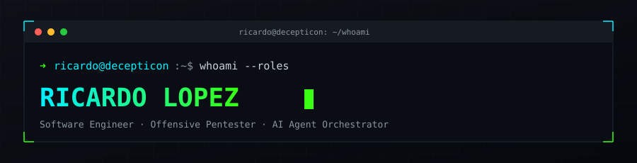
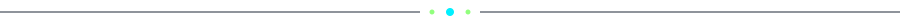
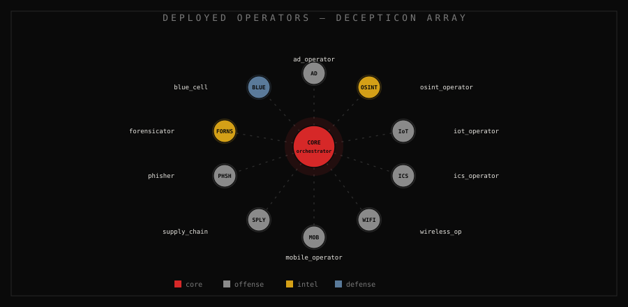
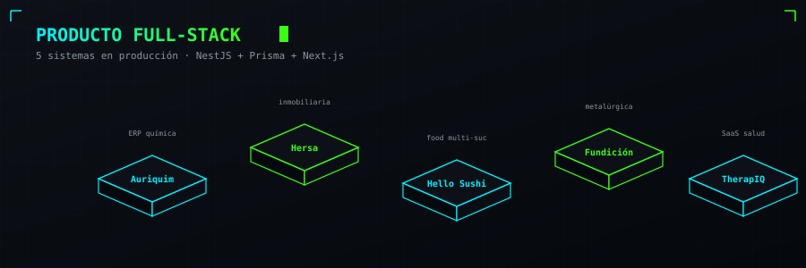
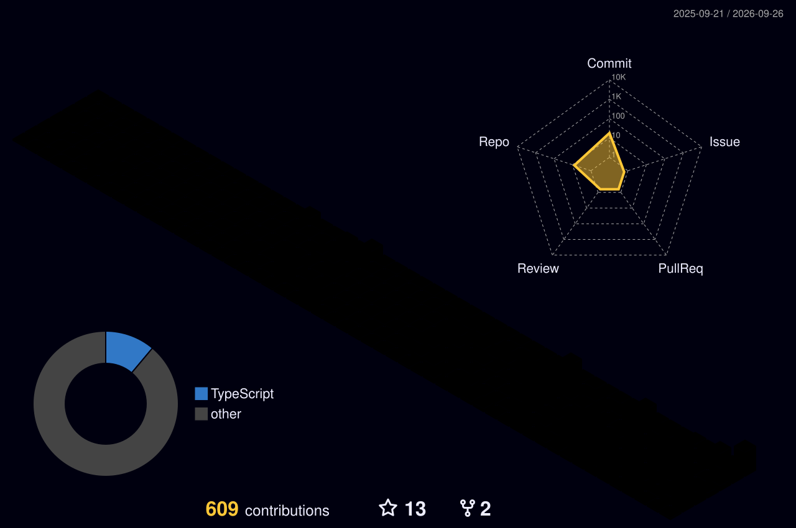

  

  

  
  
  
  

Mazatlán, Sinaloa 🇲🇽 · 2 años ingeniero + 6 freelance

### ⌘ Operador — tres verticales

<table>
  <tr>
    <td align="center" width="33%">
      <h4>🏭 Producto</h4>
      <b>5 ERPs</b> en producción 
      NestJS · Prisma · Next.js
    </td>
    <td align="center" width="33%">
      <h4>🎯 Seguridad</h4>
      <b>Decepticon</b> · 11 operadores 
      6 engagements · 5 HTB
    </td>
    <td align="center" width="33%">
      <h4>🤖 IA</h4>
      <b>7 repos</b> NuevoViruz 
      Sentinel · OpenCode Mobile
    </td>
  </tr>
</table>

  

  

Framework de **pentesting autónomo sobre LangGraph** — kill-chain completa, de reconocimiento a reporte, con operadores especializados por dominio.

  

  
  
  

**Engagements autorizados (black-box):**

  
  
  
  
  
  

+ routers IZZI/MegaCable · monitor mode BCM4387 (M1 Pro) · 5 máquinas Hack The Box

## Trabajo destacado

  

<table>
  <tr>
    <td align="center" width="25%"><b>Auriquim</b> ERP · química</td>
    <td align="center" width="25%"><b>Hersa</b> inmobiliaria · multi-tenant</td>
    <td align="center" width="25%"><b>Hello Sushi</b> food multi-sucursal</td>
    <td align="center" width="25%"><b>Fundición</b> metalúrgica · aluminio</td>
  </tr>
  <tr>
    <td align="center"><b>TherapIQ</b> SaaS salud</td>
    <td align="center"><a href="https://github.com/ING-Ricardo-Lopez/SignoSonoro"><b>SignoSonoro</b> ⭐3</a> audio → señas</td>
    <td align="center"><a href="https://github.com/ING-Ricardo-Lopez/PATO"><b>PATO</b> ⭐2</a> visión artificial</td>
    <td align="center"><b>JuegoTrazo</b> fighting game web</td>
  </tr>
  <tr>
    <td align="center"><b>NuevoViruz</b> ecosistema agentes IA</td>
    <td align="center"><b>Sentinel</b> verifica código IA</td>
    <td align="center"><b>OpenCode Mobile</b> PWA control agente</td>
    <td align="center"><b>ERP Angalf</b> academia kickboxing</td>
  </tr>
</table>

## Actividad

  

  
  

  

  🥋 Cinta negra 1er Dan · Kickboxing & Muay Thai &nbsp;·&nbsp; 🎸 Linkin Park / Metallica / Ice Cube

  

