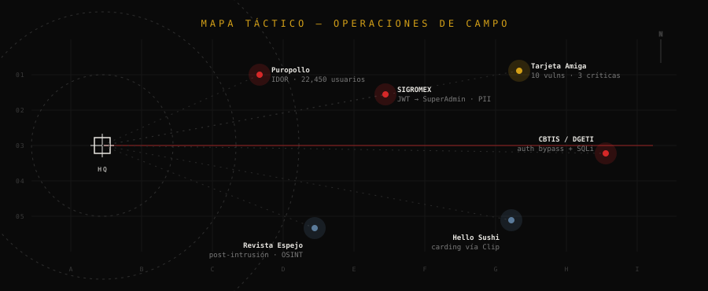

  

  <svg xmlns="http://www.w3.org/2000/svg" width="340" height="46" viewBox="0 0 340 46">
    <rect width="340" height="46" fill="#0a0a0a"/>
    <g fill="#e8e6e1">
      <rect x="16" y="8" width="3" height="26"/><rect x="22" y="8" width="1" height="26"/><rect x="26" y="8" width="2" height="26"/><rect x="32" y="8" width="4" height="26"/><rect x="40" y="8" width="1" height="26"/><rect x="44" y="8" width="2" height="26"/><rect x="50" y="8" width="3" height="26"/><rect x="58" y="8" width="1" height="26"/><rect x="62" y="8" width="4" height="26"/><rect x="70" y="8" width="2" height="26"/><rect x="76" y="8" width="1" height="26"/><rect x="80" y="8" width="3" height="26"/><rect x="86" y="8" width="2" height="26"/><rect x="92" y="8" width="4" height="26"/><rect x="100" y="8" width="1" height="26"/><rect x="104" y="8" width="2" height="26"/><rect x="110" y="8" width="3" height="26"/><rect x="118" y="8" width="1" height="26"/><rect x="122" y="8" width="4" height="26"/><rect x="130" y="8" width="2" height="26"/><rect x="136" y="8" width="3" height="26"/><rect x="144" y="8" width="1" height="26"/><rect x="148" y="8" width="2" height="26"/><rect x="154" y="8" width="4" height="26"/><rect x="162" y="8" width="1" height="26"/><rect x="166" y="8" width="3" height="26"/><rect x="174" y="8" width="2" height="26"/><rect x="180" y="8" width="1" height="26"/><rect x="184" y="8" width="4" height="26"/><rect x="192" y="8" width="2" height="26"/><rect x="198" y="8" width="3" height="26"/><rect x="206" y="8" width="1" height="26"/><rect x="210" y="8" width="2" height="26"/><rect x="216" y="8" width="4" height="26"/><rect x="224" y="8" width="1" height="26"/><rect x="228" y="8" width="3" height="26"/><rect x="236" y="8" width="2" height="26"/><rect x="242" y="8" width="1" height="26"/><rect x="246" y="8" width="4" height="26"/><rect x="254" y="8" width="2" height="26"/><rect x="260" y="8" width="3" height="26"/><rect x="268" y="8" width="1" height="26"/><rect x="272" y="8" width="2" height="26"/><rect x="278" y="8" width="4" height="26"/><rect x="286" y="8" width="1" height="26"/><rect x="290" y="8" width="3" height="26"/><rect x="298" y="8" width="2" height="26"/><rect x="304" y="8" width="4" height="26"/><rect x="312" y="8" width="1" height="26"/><rect x="316" y="8" width="2" height="26"/>
    </g>
    <text x="170" y="44" font-family="'JetBrains Mono',monospace" font-size="7" fill="#7a7a7a" text-anchor="middle" letter-spacing="3">MX-SIN-0451 · NV/2026 · NIVEL 5</text>
  </svg>

CANALES DE TRANSMISIÓN

  
  
  
  

<code>§ § §   //   MATERIAL CLASIFICADO — NO DISTRIBUIR   //   § § §</code>

### 🗂 ÍNDICE DEL EXPEDIENTE

  <a href="#s01"><code>§01 DOMINIOS</code></a> ·
  <a href="#s02"><code>§02 DECEPTICON</code></a> ·
  <a href="#s03"><code>§03 OPERACIONES</code></a> ·
  <a href="#s04"><code>§04 ACTIVOS</code></a> ·
  <a href="#s05"><code>§05 SERVICIO</code></a> ·
  <a href="#s06"><code>§06 PERSONAL</code></a> ·
  <a href="#vault"><code>🔒 BÓVEDA</code></a>

<h2 id="s01">§ 01 · DOMINIOS OPERATIVOS</h2>

<table>
  <tr>
    <td align="center" width="33%">
      DOMINIO <b>PRODUCTO</b> 
      5 ERPs en producción NestJS · Prisma · Next.js
    </td>
    <td align="center" width="33%">
      DOMINIO <b>SEGURIDAD OFENSIVA</b> 
      Decepticon · 11 operadores 6 operaciones · 5 HTB
    </td>
    <td align="center" width="33%">
      DOMINIO <b>AGENTES IA</b> 
      7 repos · NuevoViruz Sentinel · OpenCode Mobile
    </td>
  </tr>
</table>

  

<code>▔ ▔ ▔ ▔ ▔   //   FIN § 01   //   ▔ ▔ ▔ ▔ ▔</code>

<h2 id="s02">§ 02 · ACTIVO PRINCIPAL — DECEPTICON</h2>

  

Framework de pentesting autónomo sobre **LangGraph** — kill-chain completa, de reconocimiento a reporte.

<table>
  <tr><td width="22%">RAZONAMIENTO</td><td>Middleware de pentester senior · tech-stack → TTPs · inferencia de cadenas de exploit · pensamiento lateral</td></tr>
  <tr><td>REPORTES</td><td>Markdown → PDF / HTML / DOCX · ejecutivo + técnico · ES / EN</td></tr>
  <tr><td>CONTROL</td><td>Rules of Engagement · gates humanos por fase · SDK · hallazgos SARIF · benchmark interno</td></tr>
</table>

<code>▔ ▔ ▔ ▔ ▔   //   FIN § 02   //   ▔ ▔ ▔ ▔ ▔</code>

<h2 id="s03">§ 03 · OPERACIONES DE CAMPO — black-box (autorizado)</h2>

  
  
  

  

<b>OP-01</b> · Puropollo 

Plataforma de pedidos de comida. <b>IDOR crítico</b>: el endpoint <code>/orders/{id}</code> accesible sin autenticación exponía datos de pedidos de ~22,450 usuarios (dirección, método de pago, productos). Reportado y corregido.

<b>OP-02</b> · SIGROMEX 

ERP corporativo. Cadena de explotación: spec OpenAPI expuesto → bypass JWT cross-tenant → escalada a cuenta SuperAdmin + fuga de PII. 14 vulnerabilidades (3 críticas).

<b>OP-03</b> · Tarjeta Amiga 

Sistema de crédito. 10 vulnerabilidades (3 críticas) detectadas en QA pre-producción antes del despliegue.

<b>OP-04</b> · CBTIS 051 / DGETI 

Sistema educativo gubernamental (preinscripciones). Auth bypass + SQLi + volcado de PII en PHP vanilla y portal Laravel.

<b>OP-05</b> · Hello Sushi 

Cadena de restaurante. Investigación de carding masivo (~30 cargos fraudulentos con la misma tarjeta) vía procesador de pagos Clip.

<b>OP-06</b> · Revista Espejo 

Medio de periodismo. Pentest post-intrusión: OSINT del staff, bypass de WPS Hide Login, análisis de plugins WordPress vulnerables.

<b>OP-07</b> · Tecnocom / ASISTEA 

Red Team autorizado contra <code>checador.tecnocom.dev</code> (sistema ASISTEA). <b>4/4 objetivos completados</b>, crown jewels alcanzadas. Reportes ejecutivo + técnico generados en español.

<b>OP-08</b> · briq 

Engagement de campo del framework <b>Decepticon</b> — pentesting ofensivo autorizado con el orquestador multi-agente. Hallazgos documentados internamente; caso real de uso del framework en producción.

+ routers IZZI / MegaCable · monitor mode BCM4387 (M1 Pro) · 5 máquinas Hack The Box comprometidas autónomamente

<code>▔ ▔ ▔ ▔ ▔   //   FIN § 03   //   ▔ ▔ ▔ ▔ ▔</code>

<h2 id="s04">§ 04 · REGISTRO DE ACTIVOS</h2>

Hacé clic en cada expediente para desclasificar su contenido.

<b>01</b> · Auriquim [ERP · química / jabones] <code>PROD</code> 

    
finanzas (facturas globales, notas de crédito, CxC/CxP) · inventario dual · precios especiales · comodato de cliente · órdenes de compra · RBAC granular · Dokploy

<b>02</b> · Hersa [inmobiliaria · multi-tenant] <code>PROD</code> 

    
ventas · cotización · amortización · reservaciones · comisiones · CFDI · CRM de asesor · ledger · 47 modelos Prisma · fuzz harness + DTO/schema checker propios

<b>03</b> · Hello Sushi [cadena food · multi-sucursal] <code>PROD</code> 

   
CEDIS · inventario · solicitudes de compra · recepción · POS · dispatch con mapa · variantes/modificadores · roles cedis_operator/manager

<b>04</b> · ERP de fundición [metalúrgica · aluminio] <code>PROD</code> 

   
foundry orders · fusion calendar con drag & drop · hornos · stock reservation polimórfico · aleaciones/recetas (AlSi9Cu3) · kiosko · sales orders

<b>05</b> · TherapIQ [SaaS salud · psicología] <code>PROD</code> 

    
admin · integración IA con circuit breaker · auth · notificaciones · import CSV · planes de tratamiento · multi-tenant por clínica · 8 cambios SDD, 135 tareas

<b>06</b> · <a href="https://github.com/ING-Ricardo-Lopez/SignoSonoro">SignoSonoro</a> [audio → señas] <code>PÚBLICO ⭐3</code>

Detección de audio para conversión a lenguaje de señas.

<b>07</b> · <a href="https://github.com/ING-Ricardo-Lopez/PATO">PATO</a> [visión artificial] <code>PÚBLICO ⭐2</code>

Plataforma de Análisis y Training — corrección de ejercicios en tiempo real mediante visión artificial.

<b>08</b> · JuegoTrazo [fighting game · web] <code>DEV</code> 

   
Fighting game 2D web multijugador estilo MK/Street Fighter, personajes basados en compañeros de oficina · netcode delay-based · character creator

<b>09</b> · NuevoViruz [suite de agentes IA] <code>ACTIVO</code> 

7 repos: runtime de coding agent · memoria persistente que aprende tu estilo (Go) · AI code review · TUI dashboard (Go) · CLI (Go) · skills · SDD con sub-agentes

<b>10</b> · Sentinel [verifica código IA] <code>ACTIVO</code> 

 
Capa de inteligencia de contexto que verifica que el código generado por IA realmente funcione · 3 módulos (Verify · Context · Critic) · MCP tools

<b>11</b> · OpenCode Mobile [PWA control agente] <code>ACTIVO</code>

PWA para controlar el agente de código desde el celular (chat + terminal vía <code>opencode serve</code>).

<b>12</b> · ERP Angalf [academia kickboxing] <code>PROD</code>

  
Gestión de academia: alumnos, asistencias, mensualidades.

<code>▔ ▔ ▔ ▔ ▔   //   FIN § 04   //   ▔ ▔ ▔ ▔ ▔</code>

<h2 id="s05">§ 05 · HOJA DE SERVICIO</h2>

  

  
  

  

<code>▔ ▔ ▔ ▔ ▔   //   FIN § 05   //   ▔ ▔ ▔ ▔ ▔</code>

<h2 id="s06">§ 06 · EXPEDIENTE PERSONAL</h2>

<table>
  <tr><td width="28%">RANGO</td><td>Cinta negra 1er Dan — Kickboxing & Muay Thai (2do Dan en proceso)</td></tr>
  <tr><td>AUDIO</td><td>Linkin Park · Metallica · Ice Cube — rock / nu-metal / rap / electrónica</td></tr>
  <tr><td>LIBRE</td><td>League of Legends · Minecraft · series · tecnología</td></tr>
</table>

<code>▔ ▔ ▔ ▔ ▔   //   FIN § 06   //   ▔ ▔ ▔ ▔ ▔</code>

<h2 id="vault">🔒 BÓVEDA — ACCESO RESTRINGIDO</h2>

<b>DESCLASIFICAR</b> contenido restringido

- 📫 <b>Contacto directo:</b> rl0051844@gmail.com · WhatsApp +52 669 221 8002
- 💼 <b>LinkedIn:</b> Ricardo Lopez Espinoza
- 🧠 <b>Filosofía:</b> fundamentos antes que frameworks · la IA es una herramienta, el humano dirige
- ⚡ <b>Disponible para:</b> producto full-stack · seguridad ofensiva autorizada · orquestación de agentes IA

— DESCLASIFICADO bajo autorización del operador —

— FIN DEL EXPEDIENTE —

<code>“La IA es una herramienta. Nosotros dirigimos, ella ejecuta.”</code>

